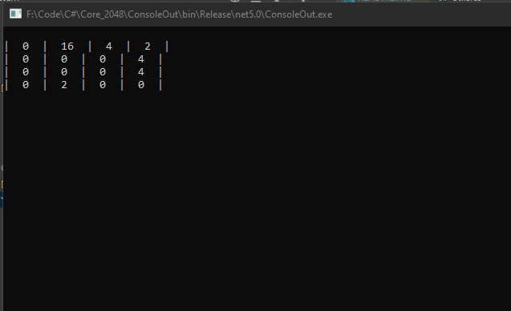
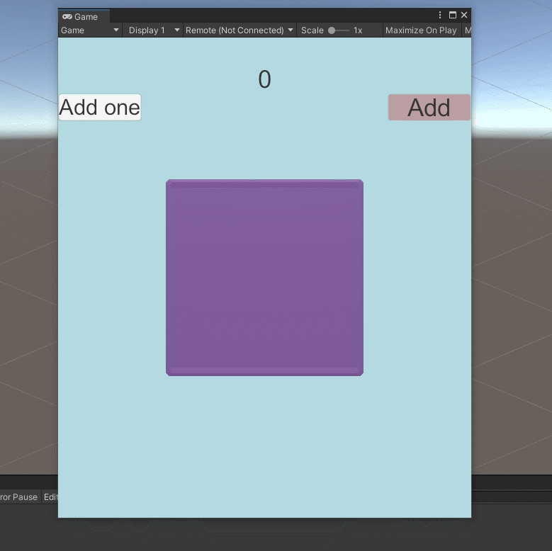

2048
====

My take mini sdk libs for creating the 2048 game in C#. Suitable for any engine from console app to Unity game. Only
2048 game logic. A very simple customizable core for initialization game with params:

* canvas size
* base value, which means blank cells
* configuring merging elements value
* configuring predicate elements value
* customizable amount of value for new cells with customizable chance of creation for each individual case
* generic for the element value (Convenient for use in game engines)

## Easy to implements in your game:

1. Create a game board with height, width and initialized value
2. Create a generator of random elements, set the check to an empty element and add a list of elements to the pool to generate with a specified percentage probability (Or you can create your own generator by implementing ***IElementGenerator***)
3. Create ***Core*** with **board**, **baseValue**, **merge** delegate, **predictor**, **element generator**
4. Call ***AddNew*** for generating and add new element on board
4. In the game loop, call the ***Update*** with arguments:
    * ***isAlongRow*** - true when movement **left** and **right** if render from up to down;
    * ***isIncreasing*** - true when movement **left** and **up** (if board render from **up** to **down**) or **down** (if board render from **down** to **up**);
5. Add listeners on ***Updated*** action to see if cells moved after ant action.
6. Call ***AddNew*** method when need add new value at board.
7. Create Render method in your engine. In Core class has methods for base iteration and there is updating map with movement info for easier implementation of interaction with external object.

Sample console project in ConsoleOut directory.

###Example code:

 [screenshot](doc/2048_console_app_code.png "Source code for a console app")

### Here's how it looks like:

### Also implementation in Unity:

